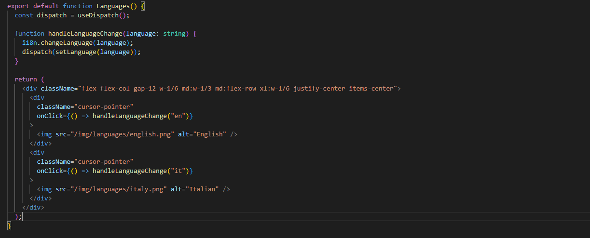

<br />
<div align="center">
    

<h3 align="center">FoodPrint</h3>

  <p align="center">
    Welcome to FoodPrint, a quiz web app designed to raise awareness about food and its impact on the environment and people.
    <br />
    Are you up for the challenge? Test your knowledge and learn about sustainable food choices.
    <br />
    <a href="https://food-print.vercel.app/"><strong>View Demo</strong></a>
    <br />
  </p>
</div>
<!-- TABLE OF CONTENTS -->
<details>
  <summary>Table of Contents</summary>
  <ol>
    <li><a href="#built-with">Built With</a></li>
    <li><a href="#getting-started">Getting Started</a></li>
    <li><a href="#installation">Installation</a></li>
    <li><a href="#usage">Usage</a></li>
    <li><a href="#technical-choices">Technical Choices</a></li>
    <li><a href="#license">License</a></li>
    <li><a href="#contact">Contact</a></li>
  </ol>
</details>

### Built With

<ul style="list-style-type: none;">
<li>

</li>
<li>
  
</li>
<li>

</li>

</li>
<li>

</li>
</ul>

## Getting Started

This is an example of how you may give instructions on setting up your project locally.
To get a local copy up and running follow these simple example steps.

### Installation

1. Clone the repo
   ```sh
   git clone https://github.com/github_username/repo_name.git
   ```
2. Install NPM packages
   ```sh
   npm install
   ```
3. Run
   ```js
   npm run dev
   ```
4. Press "o" or click the link in the terminal.

## Usage

<ul style="list-style-type: none;">
    <li>
      <h6>Select the Language</h6>
      
    </li>
    <li>
      <h6>Navigate the Home</h6>
      <ul>
        <li>Start the quiz with the "Learn More..." button</li>
        <li>Learn more about the app using the accordion buttons</li>
      </ul>
      
    </li>
    <li>
      <h6>Take the Quiz</h6>
      <ul>
        <li>Answer the questions</li>
        <li>If you rethink your answer, you can change it before clicking the "Next" button</li>
      </ul>
      
    </li>
    <li>
      <h6>View the Results</h6>
      <ul>
        <li>Learn about your skills</li>
        <li>Return to the home page and retake the quiz using the "Restart" button</li>
        <li>If you made some errors, watch the questions you answered incorrectly</li>
      </ul>
      
    </li>
    <li>
      <h6>Return to the Home Page</h6>
      <div>After your first attempt, you can view your high score and a summary of your skills directly on the home page
      </div>
      
    </li>
  </ul>

## Technical Choices

  <div>
    <h6>React</h6>
    <div>Chosen to create dynamic and engaging interfaces thanks to its component-based structure and virtual DOM.</div>
    <br>
    <div><strong>Main Pages and Related Components</strong></div>
    <ul>
      <li>
        <div>Home</div>
        <ul>
          <li>
            <div>Hero</div>
            <ul>
              <li>HomePageImage</li>
            </ul>
          </li>
          <li>Separator</li>
          <li>Faq</li>
        </ul>
      </li>
      <li>Languages</li>
      <li>
        <div>QuizQuestions</div>
        <ul>
          <li>
            <div>Answers</div>
            <ul>
              <li>Answer</li>
            </ul>
          </li>
          <li>Question</li>
          <li>Separator</li>
          <li>ProgressionBar</li>
          <li>
            <div>NextOrEndButtons</div>
            <ul>
              <li>NextButton</li>
            </ul>
          </li>
        </ul>
      </li>
      <li>
        <div>Result</div>
        <ul>
          <li>ResultRender</li>
          <li>Separator</li>
          <li>ActionButton</li>
          <li>Accordion</li>
          <li>
          <div>WrongAnswerRender</div>
            <ul><li>WrongAnswer</li></ul>
          </li>
        </ul>
      </li>
    </ul>
  </div>

  <h6>Redux</h6>
    <div>Used to manage the global state of the application in a consistent and predictable manner.</div>
    <br>
  <ul>
    <li><b>setLanguage:</b> Set the selected language for the quiz and mark that languages have been selected.</li>
    <li><b>setIsStarted:</b> Set the quiz state to indicate whether it has started or not.</li>
    <li><b>setIsFinished:</b> Set the quiz state to indicate whether it has finished or not.</li>
    <li><b>setIndex:</b> Increment the current question index to move to the next one.</li>
    <li><b>setProgression:</b> Update the quiz progress percentage.</li>
    <li><b>setAnswersClicked:</b> Set whether the answers have been clicked.</li>
    <li><b>addCorrectAnswerToScore:</b> Increment the score if an answer is correct.</li>
    <li><b>showResults:</b> Display the quiz results, updating the state based on the user's response.</li>
    <li><b>restart:</b> Reset the quiz state to start a new game, retaining some information like the maximum score,
      selected language, etc.</li>
    <li><b>nextQuestion:</b> Move to the next question, update the index, progression, and user's response.</li>
    <li><b>startQuiz:</b> Mark that the quiz has been started and increment the number of attempts.</li>
    <li><b>setCurrentUserAnswer:</b> Set the current user's answer.</li>
    <li><b>setCurrentCorrectAnswer:</b> Set the correct answer for the current question.</li>
  </ul>

  <h6>Typescript</h6>
    <div>Added to enhance code safety through static typing and error detection during development.</div>
    <br>
  <h6>TailwindCSS</h6>
    <div>Adopted to style the application quickly and efficiently, using pre-defined HTML classes.</div>
    <br>
  <h6>i18n</h6>
    <div>Integrated to support multilingualism, allowing users to select their preferred language and making the application accessible to a wide audience.</div>
    <div>For using i18n, I've created three files per language (Italian and English).
  <br>
  One file contains all the static parts of the website, another file for questions and answers, and a third file for the final test results including images and skills.</div>
  <br>
  <div><b>Change language component:</b></div>
  <br>

</code>
<br>

## License

Distributed under the MIT License.

<!-- CONTACT -->

## Contact

Marco Momo - [Website/Portfolio](https://wsmomo.github.io/Portfolio-Marco-Momo/)

Linkedin - [https://www.linkedin.com/in/marco-momo-61b08a159/](https://www.linkedin.com/in/marco-momo-61b08a159/)

Github - [https://github.com/wsmomo/](https://github.com/wsmomo/)

Project Link - [https://github.com/WSMomo/FoodPrint](https://github.com/WSMomo/FoodPrint)

Live Demo - [https://food-print.vercel.app/](https://food-print.vercel.app/)
